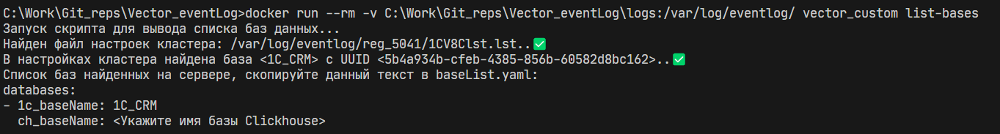

# **Vector_Eventlog.** Парсинг журнала регистрации 1С

- [Назначение](#назначение)
- [Возможности](#возможности)
- [Варианты использования](#варианты-использования) 
  - [Docker](#docker)
    - [Базовые сценарии](#базовые-сценарии)
    - [Доп.Возможности](#допвозможности)
- [Лицензия](#лицензия)

## Назначение

Проект создан для удобного экспорта журнала регистрации из 1 или больше баз.

### Возможности

- Vector_Eventlog - это конфигурация Vector для разбора и трансформации файлов журнала регистрации
- Предоставляет возможности экспорта журнала регистрации в различные форматы
- Выгрузка результатов парсинга в различных форматах
  - В файлы в различных форматах
  - В в консоль
  - В **Clickhouse**
  - В **Loki** и другие аггрегаторы логов
- Возможность масштабирования решения в случае большего объема логов
- Возможность сбора Журнала регистрации с нескольких серверов приложений, а так же с нескольких баз одновременно

## Варианты использования

### Docker

#### Базовые сценарии

1. Сбор логов с одной базы.

   - Подготовьте docker-compose.yml
     - Укажите значения переменных для подключения к инстансу clickhouse. (`CH_SERVER`, `CH_USER`, `CH_PASSWORD`)
     - Укажите параметры используемой базы и таблиц(`CH_BASE_NAME`, `LOG_TABLE`, `ERROR_TABLE`)
   - Подготовьте базу clickhouse создав в ней базу и таблицы(воспользуйтесь примером скрипта [init.sql](/init.sql))
   - docker-compose up -d

1. Сбор логов с нескольких баз
   Реализован автоматический сбор логов с нескольких баз.

   - Примонтируйте папки srvinfo к `/var/log/eventlog` внутри контейнера. (прим. Папок может быть больше чем 1)
   - Подготовьте yaml-описание требуемых баз 1с, из которых вы планируете собирать ЖР
     - Можно заполнить переменную среды `BASE_LIST` Передав туда строковое представление yaml(прим. [docker-compose.yaml](examples/docker-compose_Base_list.yml))
     - Можно передать [файл со списком баз](examples/baseList.yaml), указав его расположение в переменной `BASE_LIST__FILE`. (прим. [docker-compose.yaml](examples/docker-compose_Base_list__file.yml))
     - Можно просто передать его в местоположение "по умолчанию", данный контейнер ожидает такой файл здесь: `/etc/vector/baseList.yaml`
   - docker-compose up -d
   - Все остальное произойдет автоматически. Перед стартом будет разобран файл настроек кластера 1с. Из него будут найдены UUID нужных баз, будет заполнен файл конфигурации, и тд.

#### Доп.Возможности

- Использование **docker secrets**, для хранения "Чувствительных данных", реализованы переменные среды `CH_USER__FILE` и `CH_PASSWORD__FILE`.(прим. [docker-compose.yaml](examples/docker-compose_Secrets.yml))
- Создание баз clickhouse.

  По умолчанию, перед запуском вектора, осуществляется обеспечение всех необходимых баз для сбора логов. Если необходимо отключить эту функцию необходимо задать переменную среды `CREATE_CLICKHOUSE_BASES_ALLOWED=false`

- Получение информации о доступных для сбора ЖР базах.

  Существует возможность получить список доступных для сбора ЖР баз. Для этого необходимо выполнить команду:

  ```bash
    docker run --rm -v <ваш путь к srvinfo>:/var/log/eventlog/ segateekb/vector_eventlog list-bases
  ```

  В результате вы получите полный список баз доступный для копирования.

  

---

## Лицензия

Distributed under the [Apache License, Version 2.0](http://www.apache.org/licenses/LICENSE-2.0.html)
